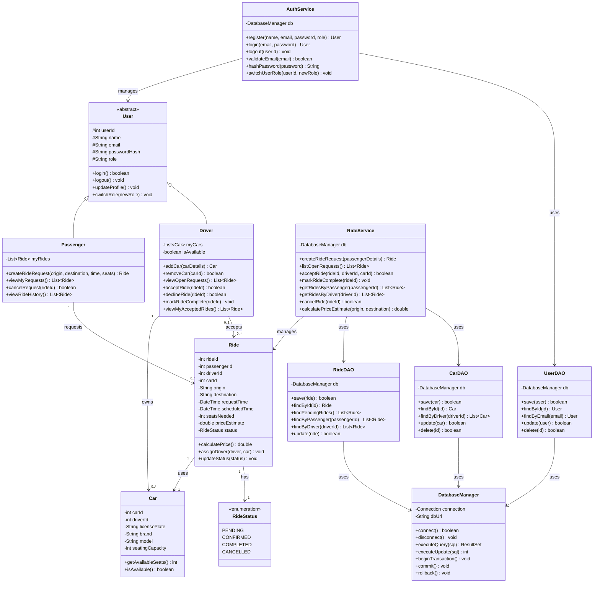
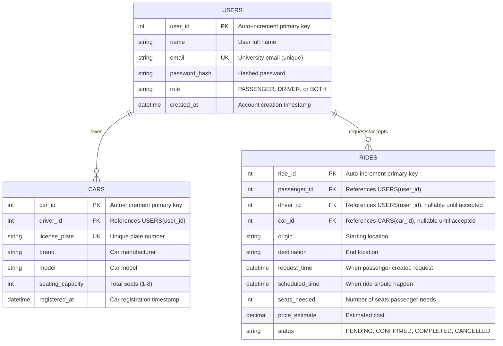
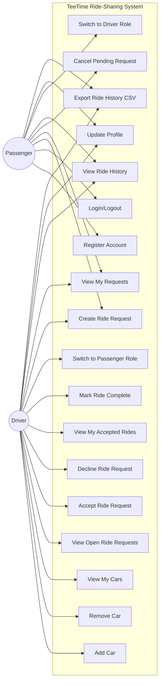
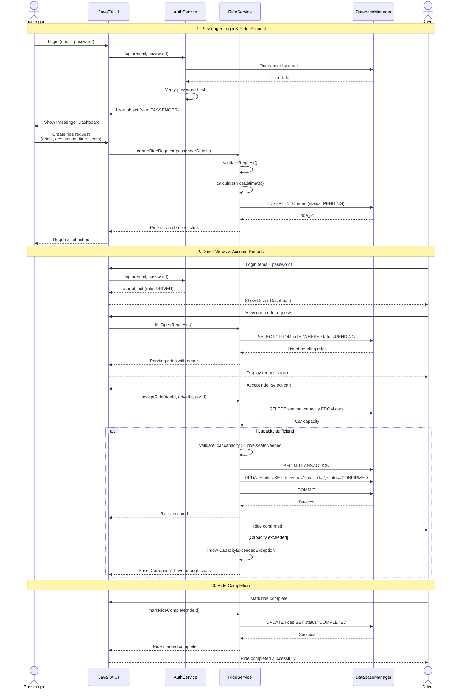
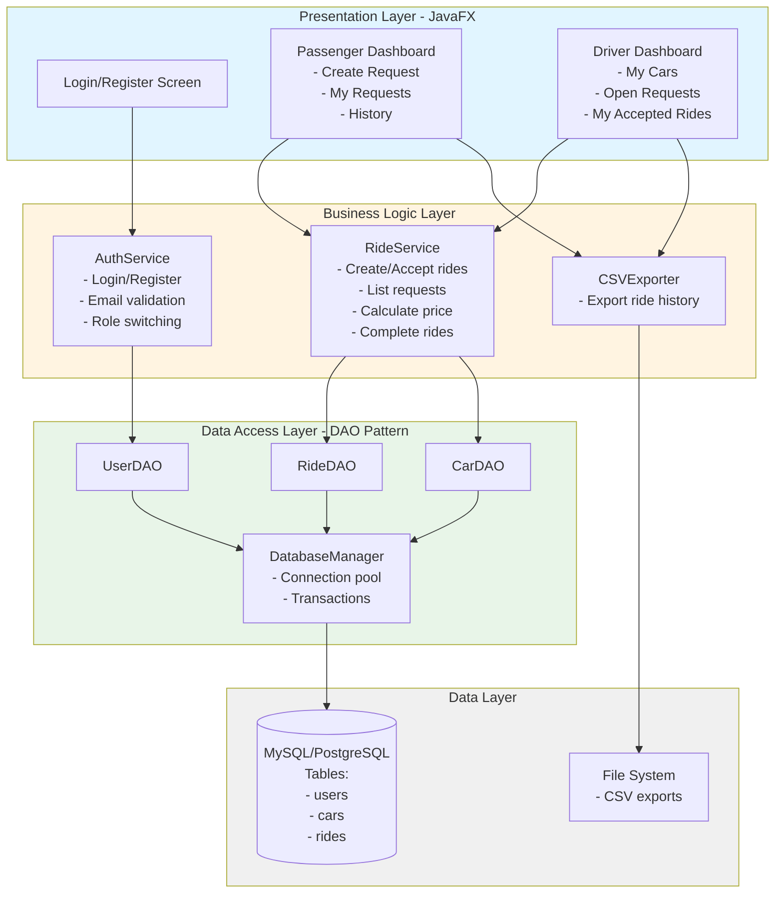
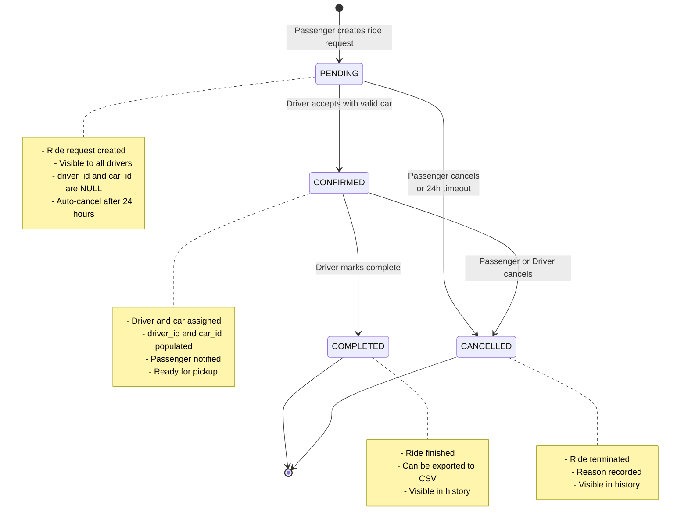
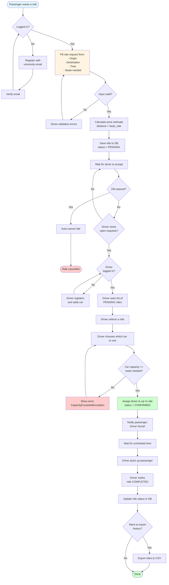

# TeeTime - System Diagrams

Campus Ride-Sharing Platform - Phase 1 Design Diagrams

## 📋 Class Diagram

Core classes, services, and data access layer for the TeeTime system.



---

## 🗄️ Entity-Relationship Diagram

Database schema with 3 core tables: USERS, CARS, and RIDES.



---

## 👥 Use Case Diagram

Core interactions for Passenger-Driver matching workflow.



---

## 🔄 Sequence Diagram - Ride Matching Flow

Complete interaction showing how a passenger request gets matched with a driver.



---

## 🏗️ System Architecture

4-layer architecture with clear separation of concerns.



---

## 🔴 State Diagram - Ride Lifecycle

Simplified 4-state lifecycle for rides: PENDING → CONFIRMED → COMPLETED/CANCELLED.



---

## 📊 Activity Diagram - End-to-End Flow

Complete workflow from passenger request creation through driver acceptance to ride completion.



---

## 📁 Files in this Directory

- **simplified-class-diagram.mermaid** - UML class diagram
- **simplified-er-diagram.mermaid** - Entity-relationship diagram
- **simplified-use-case-diagram.mermaid** - Use case diagram
- **simplified-sequence-diagram.mermaid** - Sequence diagram
- **simplified-architecture-diagram.mermaid** - Architecture diagram
- **simplified-state-diagram.mermaid** - State diagram
- **simplified-activity-diagram.mermaid** - Activity diagram
- **teetime-simplified.html** - Original HTML with all diagrams
- **teetime-simplified-fixed.html** - Fixed HTML with working diagrams
- **README.md** - This file

## 🚀 Viewing the Diagrams

**On GitHub**: All diagrams above render automatically in this README!

**Locally in VS Code**:
1. Install "Markdown Preview Mermaid Support" extension
2. Open this README file
3. Click the preview button to see diagrams

**In a Browser**:
```bash
# Start the web server (from project root)
python3 view_diagrams.py

# Then open http://localhost:8000/teetime-simplified-fixed.html
```

**In Terminal**:
```bash
# Display raw Mermaid syntax (from project root)
python3 show_diagrams.py
```

---

**Phase 1 - Core Implementation**
TeeTime Campus Ride-Sharing Platform
